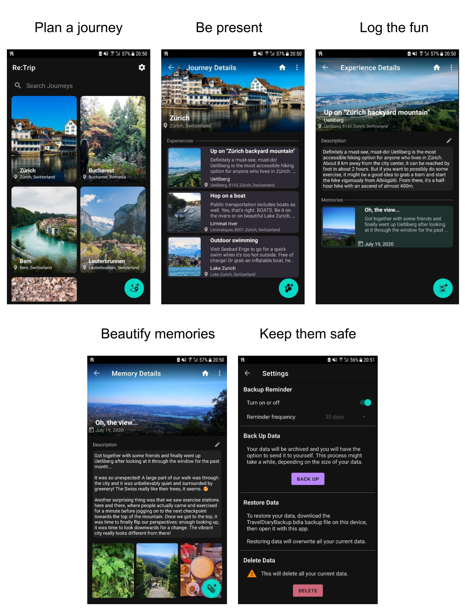

# Re:Trip
Re:Trip is an Android mobile application which acts as a travel diary and encourages users with the following simple advice:

*Plan your trips, be present while experiencing novelty, and make sure that you spend some time writing and snapping photos of your adventures, to be able to recall them as memorable as they were the first time you made them.
Let yourself be fully immersed in a new experience, while resting assured that you won’t miss out on anything, because the plan you made is a simple step-by-step travel guide. Did you enjoy that amazing ice cream? Take a picture and add a note about it. Pay attention, feel the smell and link its taste to that of previous experiences, maybe from childhood. Let’s just make sure your memories are there to stay, not to stray away.*

## Technology stack

  

## Application main flow

  

