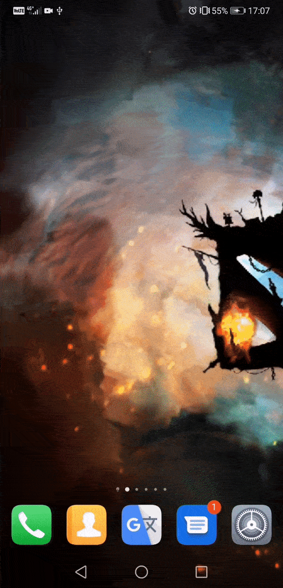
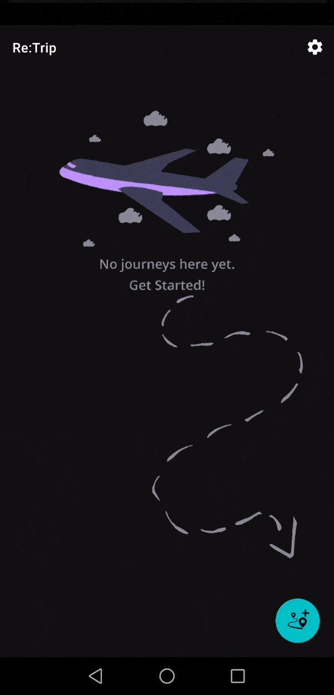
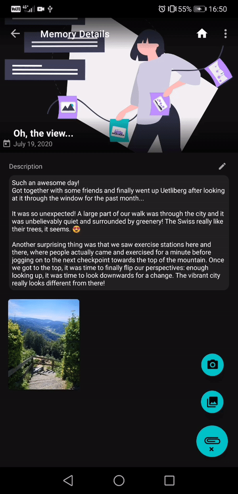
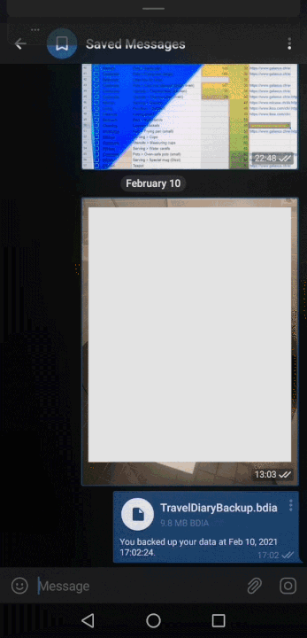

# Re:Trip
Re:Trip is an Android mobile application which acts as a digital travel diary, complete with photos, text, and the necessary structure to plan your journey experiences.

> *Plan your trips, be present while experiencing novelty, and make sure that you spend some time writing and snapping photos of your adventures, to be able to recall them as memorable as they were the first time you made them.*

> *Let yourself be fully immersed in a new experience, while resting assured that you won’t miss out on anything, because the plan you made is a simple step-by-step travel guide. Did you enjoy that amazing ice cream? Take a picture and add a note about it. Pay attention, feel the smell and link its taste to that of previous experiences, maybe from childhood. Let’s just make sure your memories are there to stay, not to stray away.*

## Technology stack
I developed the app using the following technologies, concepts, and tools:
<p align="center">
  
</p>

## Running the app
To run the app:

1. Make sure you have Android Studio IDE installed on your machine.
1. Clone the repository and checkout `master`:

    ```
    $ git clone https://github.com/disi1/TravelJournal.git
    $ cd TravelJournal
    $ git checkout master
    ```
1. In Android Studio, open the project folder.
1. Run the app using a virtual emulator or a physical device (min API level 21).

## Application main flow
Take a look at some of the things you can do with this app:
<p align="center">
  
</p>

### First launch
* Note - I used SharedPreferences to only display the Splash Screen on the very first launch of the app



### Adding a journey



### Adding an experience


### Adding a memory


### Editting a memory


### Changing the cover photo
* Note - The cover photo can be changed for Journeys, Experiences, and Memories



### Notifications


### Back up & restore data




### Deleting data


## Get in touch
Reach out at [diana.sica29@gmail.com](mailto:diana.sica29@gmail.com)
